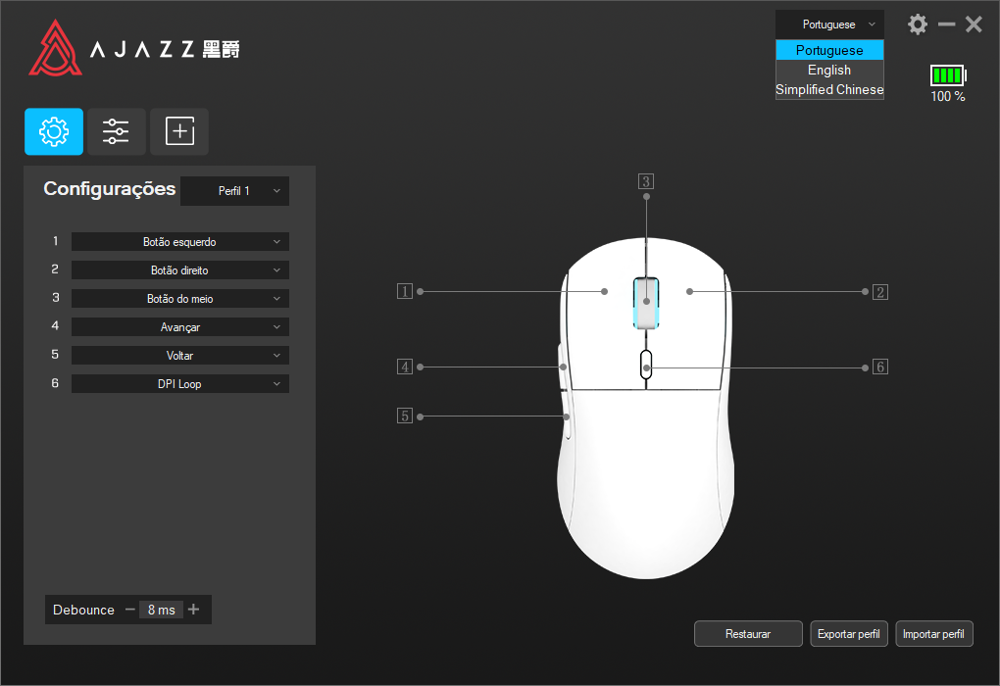
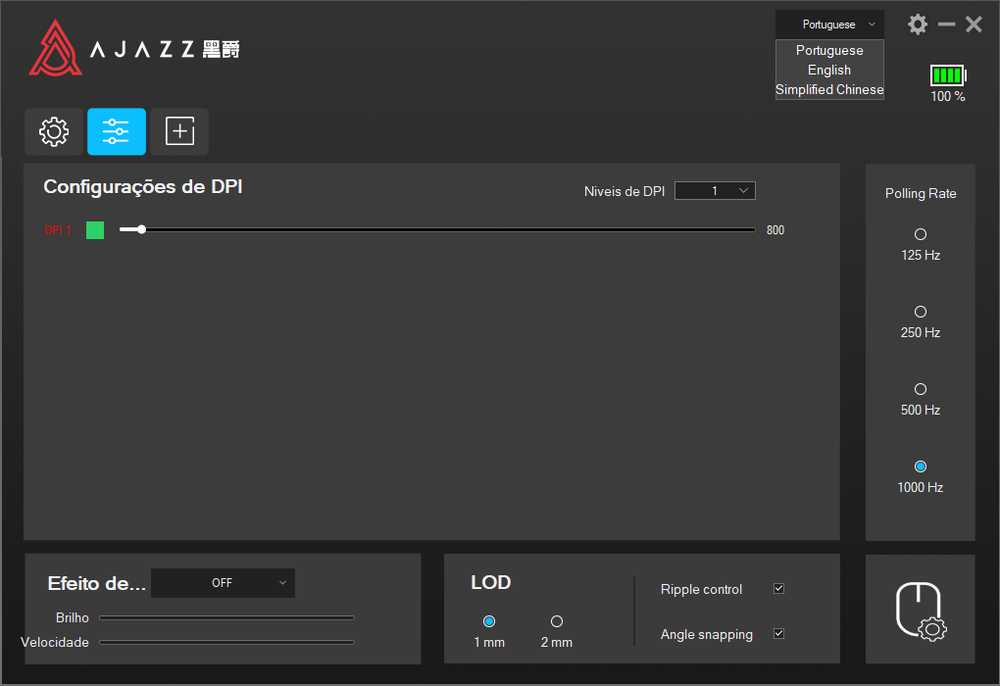

# AJAZZ-AJ-Mouse-Software-PT-BR

## Sobre o projeto
Neste repositorio está a tradução para PT-BR do software dos mouses AJAZZ modelos AJ199 e AJ139. 

## Objetivos do projeto 

|Objetivo | % Conclusao |
| :-------- |:-----------:|
|Traduzir o software em si para portugues brasileiro |    100%     |
|Resolução do erro de não aparecer bateria do mouse |    100%     |

## Porque Traduzir
A tradução visa apenas trazer acessibilidade para o publico que fala portugues e comprou o mouse. Como o software do mouse não tem tradução para o idioma eu resolvi fazer uma propria para pelo menos deixar os menus mais intuitivos e claros. Espero que gostem.

## Imagens do projeto: 
 - Menú de configurações de perfil

 - Menú de configurações de DPI 

 - Menú de configurações de macros e ações

